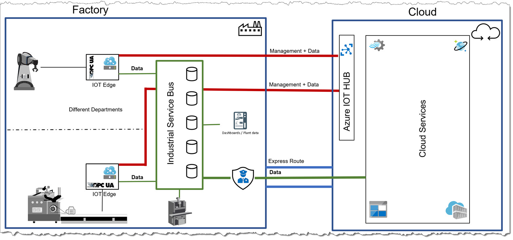

# Framework for an Industrial Service Bus with IoT Edge

Welcome to our design of an independent framework for an _Industrial Service Bus_ that is able to run on the factory floor.  
At the initial design workshop, we had more than 30+ participants from various companies, including #Intel, [#HPE](https://www.hpe.com/), #senseering and many others, which contributed to designs, code, use cases and prerequisite definitions.

> This GitHub repository represents an initial framework starter with an community approach.
> As the framework evolves, continuous improvements and contributions will be added to this repository including updates to documentation and features. Please feel free to participate and contribute!

The diagram shows the overall architecture and parts of the framework functionality.
It is explained in detail in the [documentation ("docs")](docs/README.md).  
The code for an initial fast-start implementation can be found in the [source ("src")](src/README.md) section.

## Content

### Documentation

- [Use Cases](docs/USECASES.md)
- [Requirements](docs/REQUIREMENTS.md)
- [Architecture](docs/ARCHITECTURE.md)

### Technical Implementation

- [Code example with IoT Edge](src/README.md)
- [Complete example on a single virtual machine](src/simple/README.md)

## What This Repository ___is not___

- It is not meant to be a product and as such no specific product called "Industrial Service Bus" (ISB) is provided.

## What This Repository ___is___

- It is meant and will be provided as an Open Source framework to use and implement any Industrial Service Bus (ISB). As such, it is independent from individual feature sets.
- It is about helping others to easily implement and test a modern architecture to take the next steps towards a new generation of digitized production.

## Next Steps

- Implementing [NATS](https://nats.io/) in addition to [RabbitMQ](https://www.rabbitmq.com/)
- Adding more data import modules (in addition to OPC-UA)
- Bringing [Grafana](https://grafana.com/) with [SQL Server Edge](https://azure.microsoft.com/de-de/services/sql-database-edge/) to Azure IoT Edge
- Creating an easy-to-use Visual Data Analytics module
- Many more
