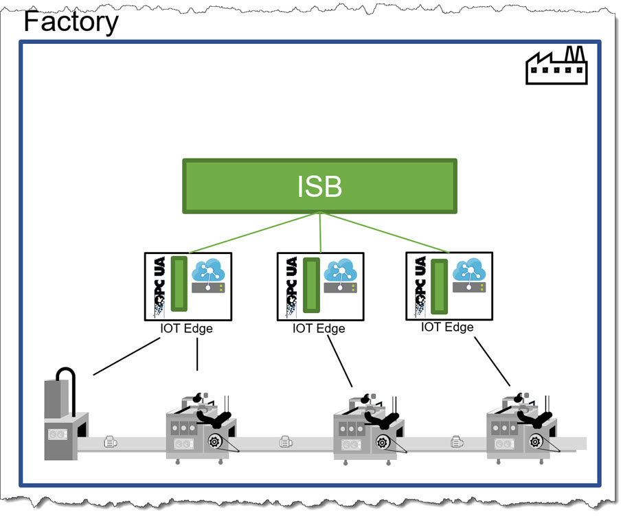
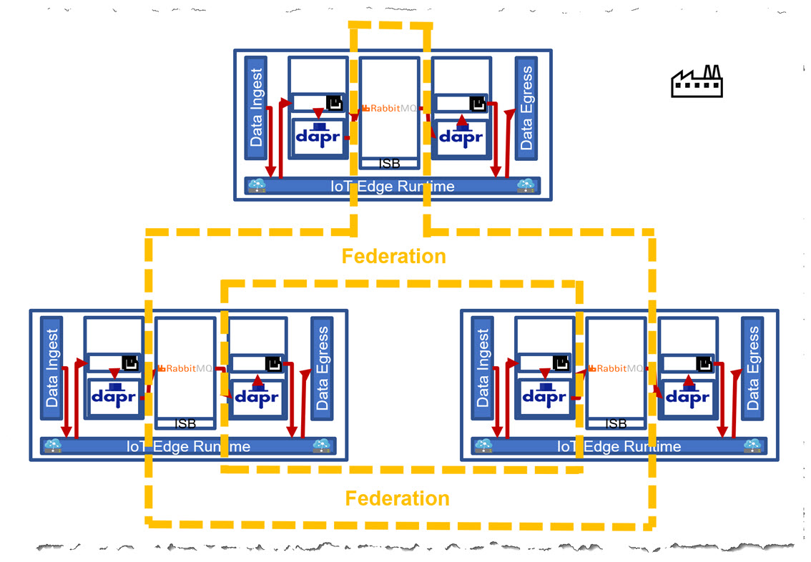
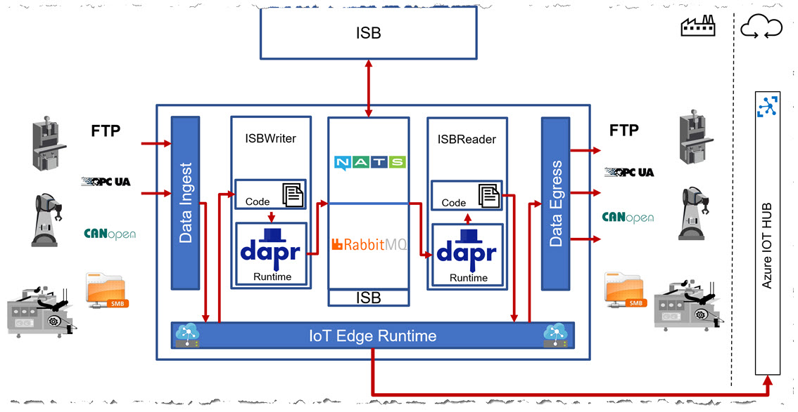

# Architecture of a Connected Factory with an Industrial Service Bus (ISB)

As more and more machines get connected and deliver data, there is a growing need to unify data access and exchange locally.
Additionally, the ISB is not only limited to accessing or exchanging data, but can also provide means to enrich or police data, process it by services and much more.  
A more detailed explanation about the "why" can be found in the [use case](USECASES.md) section.

In general, the idea is to have a mechanism in place which distributes the data collected from machines and makes it available on the shop floor so that the data is accessible everywhere—with build-in horizontal data redundancy.

The following diagram shows the overall design:

Data generated by the machine is collected via _Azure IoT Edge_ and sent to an _Industrial Service Bus_ (ISB).
From there, data can be retrieved by other IoT Edge instances, other machines, data extraction or data display mechanisms like dashboards, Manufacturing Execution Systems (MES) and many more.
Thus, roles are clearly defined and seperated.

Optionally, the ISB can also decide on vertical data routing, i.e. which data is to be sent to the cloud and which data has to stay local.
This may, e.g. be useful for use cases where data locality is paramount—like producing goods for defense industry, in which case data needs to stay within the borders of a specific country.  
While data is collected and processed by the ISB, it is still possible to open a data channel to the Azure IoT Hub from Azure IoT Edge directly to enable accessing the data in Azure.
This enables a requirements data scientists have: Being able to collect data directly from a specific machine for a give time frame to gain deeper insights on an individual level.

Another graphic to explain the idea a little more in-depth:

As depicted, a fundamental functionality of the ISB is to collect the data from various edge installations and store it locally but distributed to be accessible across all devices or interested parties while maintaining data availability by redundancy and communication between nodes.

Here, every IoT Edge installation is part of the ISB (i.e. a module of the messaging system like _RabbitMQ_ is running locally) and data is shared across all devices.
The ISB participants can be connected via federation, which acts as a redundant data storage between the devices.
This is demonstrated by the example in the [source ("src")](../src/deployment/README.md) section.

The idea is that the ISB takes care of everything related to data storage, data distribution and data governance.
In our case, with _RabbitMQ_, we are using the federation features for the distribution of the data.

One of the most important core features is the independency from specific implementations, though:

To be independent of a specific ISB messaging system implementation (like _RabbitMQ_, _NATS.io_ or other commercially available products) an abstraction layer based on [Dapr (Distributed Application Runtime)](https://dapr.io/) is used.  
The idea is to have a generic module available, which can push to and read data from the ISB without being dependent on APIs provided by a specific ISB implementation.
In our example, we can use simple REST calls to send and receive data from _RabbitMQ_.  
More details about the example implementation can be found [here](../src/README.md).

## Summary

- IoT Edge uses an ISB to achieve horizontal data redundancy and data distribution accross participants
- Independency from a specific ISB implementation is achieved by using [Dapr](https://dapr.io/) with IoT Edge
- The proposed ISB architecture fullfills the stated [use cases](USECASES.md) and some [requirements](REQUIREMENTS.md)
