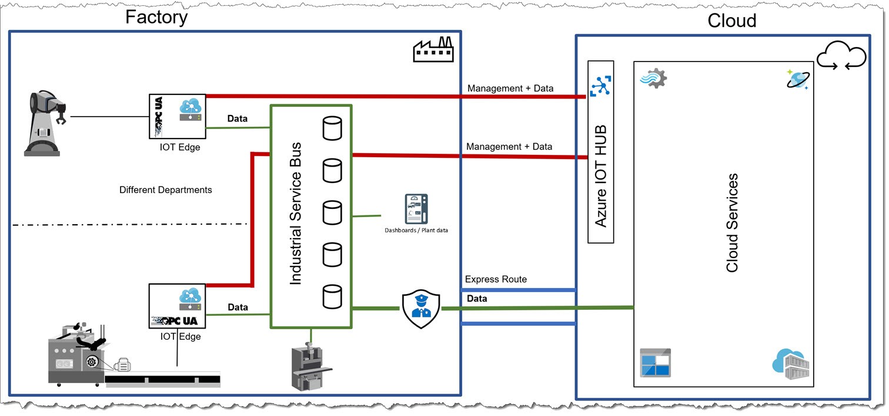

# Architecture of a connected factory with an Industrial Service Bus (ISB)

While more and more machines are getting connected and delivering data towards a centralized data service, there is a growing need to exchange data locally, which means on the shop floor between several data enabled services, before sending it to the cloud. But we are not limited to only exchange, but also to enrich, service process and policing data.
A more detailled explanation about the "why" can be found in the ["use case"](USECASES.md) section. 

In general, the idea is to have a mechanism in place which shares the collected data from the machines and make it redundant on the shop floor, in terms of a horizontal data redundancy, so that the data is availiable everywhere, HA, fault tolerant and resilient.
The following picture shows the overall design. Generated data from a machine is collected via Azure IOT Edge and than sent to an Industrial Service Bus. From there, data can be retrieved by other IOT Edge instances, other machines or other data extracting mechanisms, like a dashboard, MES Systems and many more. The roles are clearly defined.  
The most important thing: we want to be independant from the underlaying ISB product and have an approach to bring in an abstraction layer, which we will explain later.
 
Finally, the ISB can also have the task to decide, which data is to be sent to the cloud and which data has to stay local ( one use case is: producing goods for defense industry -> data needed to stay in the borders of the country).  
While the data is collected and processed by the ISB, we still have the possibility to open a data channel to the Azure IOT Hub from Azure IOT Edge directly. This was one of the requirements, that data scientists might have: Collect data directly from a specific machine for a give timeframe to have a deeper look on an individual basis, with e.g.: a higher frequency than it is typically needed inside the ISB.

 

Another graphic to explain the idea a little more detailled:
The functionality of the ISB is to collect the data with various edge installations and store the data locally, distributed across all devices and make sure, there is a redundancy and communication between the nodes.

Every IOT Edge installation is part of the ISB (e.g. a module of RabbitMQ is running) and data is shared across all devices. The ISB can, as the example in the [src](../src/deployment/README.md) section states out, be connected via a federation, which can be seen as a redundant data storage between the devices.

So the idea, the ISB takes completly care of data storage, data distribution and of course data governance. Int our case, with RabbitMQ, we are using the federation feature for the distribution of the data.
But now the important part:

To be independant from a specific implementation of an ISB, like RabbitMQ, NATS.IO or commercial avialible products, we developped an abstraction layer based on [Dapr.IO](https://dapr.io/). The idea is: having a module availiable, which can push and read data from the ISB without beeing dependant on the specific APIs from a certain ISB implementation. In our case we used a simple REST call to send and receive data from RabbitMQ. 
More detail about this specific implementation can be found [here](../src/README.md).
 
## To summarize:
* IOT Edge uses an ISB to receive horizontal data redundancy
* Thanks to [Dapr.IO](https://dapr.io/) on IOT Edge, we receive an independance from a specific ISB implementation
* With this ISB architecture we were able to fullfill the [use cases](USECASES.md) and some [requirements](REQUREMENTS.md)
