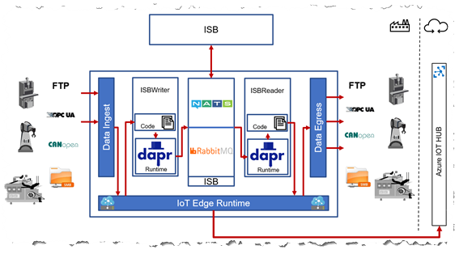

# Disclaimer

For the purpose of demontration we use default username/password for RabbitMQ running as container on IoT Edge. Also the actual broker configuration is part of this repository.  
The automatically created environment is a sandbox meaning that **all VM instances are NOT accessible from the Internet** and only private IP addresses are used.  
  
**You should NEVER use default credentials in production and/or check in your credentials into a Git repo!**  
Please consider using [Azure KeyVault](https://docs.microsoft.com/en-us/azure/key-vault/basic-concepts) for secret management and using a decent CI/CD pipeline to roll out your changes in a secure way.

# Folder structure

This section refers to the folder structure under ```/src/```.  
* ```/src/deployment``` contains all deployment scripts
* ```/src/iotedge``` contains the actual implementation and tests as well as deployment manifests
* ```/src/rabbitmq-federation``` contains the Dockerfile based on the official rabbitmq base image. It enables [rabbitmq federation plugin](https://www.rabbitmq.com/federation.html)  

# Implementation details

This demo implementation is based on [Azure IoT Edge](https://docs.microsoft.com/en-us/azure/iot-edge/about-iot-edge) and revolves around the concept of Reader and Writer.  
In fact these roles are each represented by an IoT Edge module: _ISBWriter_ and _ISBReader_ respectively.  
The Writer is responsible for reading data from a simulated PLC via OPC UA and **writing** this data into ISB using [Dapr](https://dapr.io/) [PubSub](https://github.com/dapr/samples/tree/master/4.pub-sub). The Reader on the other hand is responsible for **reading** data from the ISB, again using Dapr PubSub, and forwarding it to IoT Hub. Following diagram shows the interaction between different IoT Edge modules and Dapr. In the demo setup ISBReader and ISBWriter modules are deployed to different IoT Edge nodes [(see deployment diagram)](deployment/img/deployment_diagram.PNG) for the sake of demonstration.  
  

  

    
Right now Dapr supports two operation modes: running locally and running on Kubernetes. IoT Edge is none of those but is closer to the ‘local’ option. Both options use the [Sidecar pattern](https://docs.microsoft.com/en-us/azure/architecture/patterns/sidecar). [This blog post](https://medium.com/@vslepakov/dapr-on-azure-iot-edge-31c7020c8cda) goes into details on how to run Dapr on IoT Edge.  
  
Right now [RabbitMQ](https://www.rabbitmq.com/) is used as the underlying message broker. Since we use Dapr we can easily switch to another implementation e.g. [NATS](https://nats.io/) by simply modifying [Dapr component configuration](iotedge/modules/ISBWriter/components/rabbitmq.yaml) without any changes to the application.  
In order to configure Federation of multiple RabbitMQ broker instances (two Writers and one Reader) _RabbitMQManager_ module is used. It reads federation configuration from the IoT Edge Module Twin and applies it to the target broker instance at runtime. Unit tests for this module can be found in the ```/src/iotedge/tests``` folder.  
  
There are two deployment **templates** for Reader and Writer roles respectively:  
* ```deployment.isbwriter.template.json```
* ```deployment.isbreader.template.json```

They define IoT Edge modules for each role. Also the generated deployment **manifests** under ```/src/iotedge/config``` are part of this repo, even though normally one would not check them in. This is done on purpose to get you up and running with as little effort as possible.