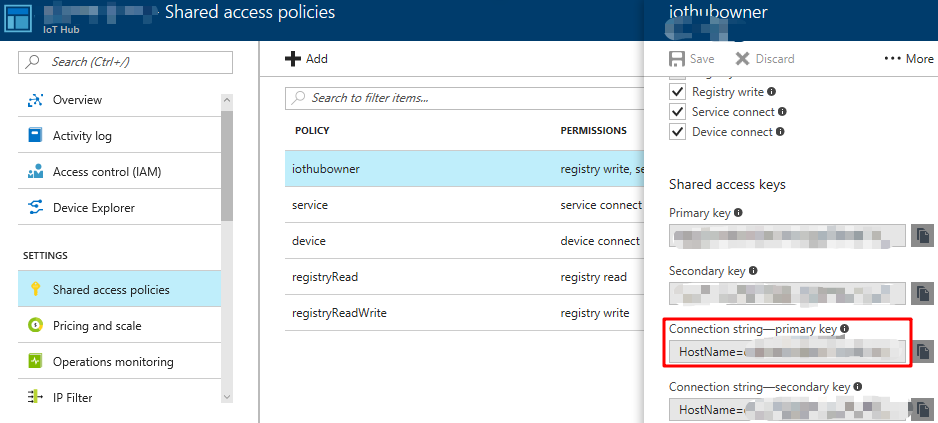

# Deploy the Demo

## Which resources get deployed?

Following resources will be created:

* 5 Ubuntu VMs (3 x IoT Edge, 2 x PLC Simulation) of size Standard_B1ms
* 1 x VNET with two Subnets
* 1 x Azure Bastion with public IP
* 1 x IoT Hub S1  

[Approximate Cost Estimate](https://azure.com/e/fb7a1c2c06e44177831868871bedd335)

## Prerequisites

Deployment is done by a **shell script** which uses az cli.
Make sure you either  
* [install az cli on your UNIX based OS](https://docs.microsoft.com/en-us/cli/azure/install-azure-cli?view=azure-cli-latest).
* or you use [Azure Cloud Shell](https://docs.microsoft.com/en-us/azure/cloud-shell/overview). **Azure Cloud shell will timeout after 20 minutes of inactivity**.  
* or you use [this az cli docker image](https://docs.microsoft.com/en-us/cli/azure/run-azure-cli-docker?view=azure-cli-latest) (also on Windows) for deployment.

If you decide to go with the docker image on Windows you first need to [activate _FILE SHARING_](https://docs.docker.com/docker-for-windows/#docker-settings-dialog)  
Then just run your container like this:  
```docker run -v C:\<path-to-the-src-folfer-in-this-github-repo>:/isb -it mcr.microsoft.com/azure-cli```  
you will have all files available under _/isb_ inside the container.

## Run deployment

Clone this repo, navigate to the _deployment_ directory and execute ```./deploy.sh [your subscriptionId] [region]``` to start the deployment. The subscription ID is optional. If you do not provide it, default subscription will be used. The region is also optional. If not specified _westus_ is used (examples: eastus, westeurope).  
   
It takes around 25 minutes to deploy and initialize everything.
At the end of a successfull deployment the script outputs **SSH username (currently _azureuser_) and the SSH private key** that you can use to connect to your VMs via SSH. None of the VMs is exposed via a public IP address which is why you will need to use Azure Bastion (created as part of the deployment) to access them [as described here](https://docs.microsoft.com/bs-cyrl-ba/azure/bastion/bastion-connect-vm-ssh#privatekey).  
After a successfull deployment you will have the setup up and running shown here (blue arrows show data flows): 
   


### Important

* Due to the lack of time the deployment script **does not** implement robust error handling. In case you run into issues: fix those, remove the complete resource group and redeploy
* VM hotnames are important since they are used as conventions in some connection strings like in e.g. _isb-demo-iotedge-1-pn.json_ or the _cloud-init-iotedge.yml_. You would need to change those as well.
* After a successful deployment an .env file is written to disk which contains some information used by the _restart-dapr.sh_ script. This is just for your convenience so you don't need to look up this information in the Azure Portal.
* _restart-dapr.sh_ is used to restart IoT Edge modules containing Dapr runtime. This is needed to account for cases where e.g. RabbitMQ or Redis are started **after** the Dapr runtime. Dapr runtime currently does not implement a retry mechanism to connect to a message broker in a pub/sub scenario. This is planned for one of the future releases. Also it is currently not possible to specify module start order in IoT Edge. [This functionality is planned for the upcoming 1.0.10 RC release](https://github.com/Azure/iotedge/blob/master/doc/ModuleStartupOrder.md).

## Validating Successful Deployment

Download and install [Azure IoT Explorer](https://github.com/Azure/azure-iot-explorer) from [here](https://github.com/Azure/azure-iot-explorer/releases).  
Retrieve IoT Hub owner connection string as shown here:  
  
  
Use this connection string to connect using Azure IoT Explorer.  
In Azure IoT Explorer select device _isb-demo-iotedge-3_ as shown here:  
  
  
then go to _Telemetry -> Start_. After some time you should see data in OPC UA Pub Sub JSON format:  
  
  
You should see two different OPC UA NodeIds:  
* ```\"NodeId\":\"nsu=http://microsoft.com/Opc/OpcPlc/;s=SpikeData\"``` from _isb-demo-plc-1_
* ```\"NodeId\":\"nsu=http://microsoft.com/Opc/OpcPlc/;s=DipData\"``` from _isb-demo-plc-2_  

Those PLCs might be located in completely different factories in different locations.  
Still, with ISB it is easy to consume this data withouth having any knowledge where it exactly comes from.

## Troubleshooting

* You can connect to each VM using Azure Bastion using provided credentials.
  * You can read IoT Edge logs using _iotedge logs <module name>_
  * You can request logs upload to a storage account using this [direct method on edgeAgent](https://github.com/Azure/iotedge/blob/master/doc/built-in-logs-pull.md)
* After a successful deployment in case you don't see the data flowing try to re-run _restart-dapr.sh_