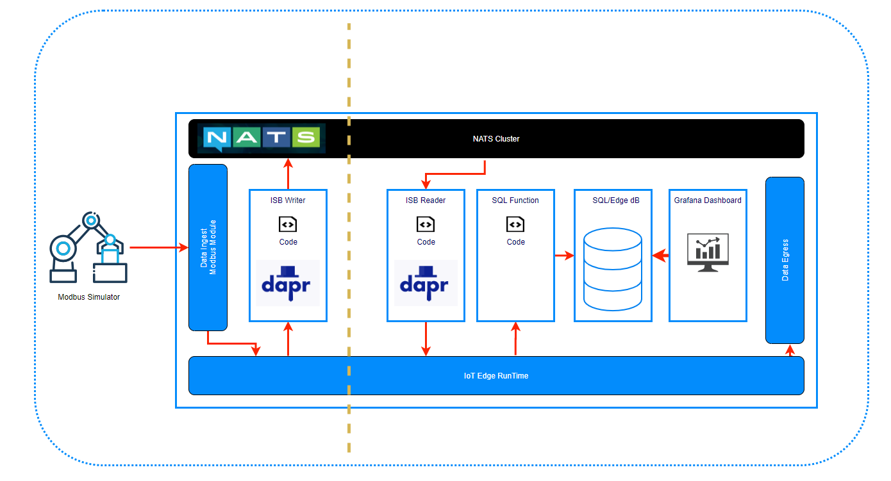

# Simple Example of the Industrial Service Bus

## Overview

## Folder Structure

This section refers to the folder structure under `src/simple`.

- `src/simple/deployment` contains all deployment scripts
- `src/simple/iotedge` contains the IoT Edge module implementations

## Implementation Details

This demo implementation is based on [Azure IoT Edge](https://docs.microsoft.com/en-us/azure/iot-edge/about-iot-edge) and revolves around the concept of Readers and Writers.  
In fact these roles are represented by IoT Edge modules, the `ISBWriter` and `ISBReader` respectively.  
The _Writer_ is responsible for reading data from a simulated Modbus Device and __writing__ this data into the ISB using [Dapr](https://dapr.io/) [PubSub](https://github.com/dapr/samples/tree/master/4.pub-sub).  
The _Reader_ on the other hand is responsible for __reading__ data from the ISB, again using Dapr PubSub and forwarding this data to a local SQL Database.
We use [Grafana](https://grafana.com/) to visualize the incoming data stored in a database.

The following diagram shows the interaction between different IoT Edge modules and Dapr. In the demo setup `ISBReader` and `ISBWriter` modules are deployed to the same IoT Edge to make this example as simple as possible (see [deployment diagram](deployment/img/deployment_simple.png)).

Dapr currently supports two modes of operation:

- _Standalone_: running locally
- _Kubernetes_: running on Kubernetes cluster

IoT Edge is none of those, but is closer to the _Standalone_ option.  
Both options use the [Sidecar pattern](https://docs.microsoft.com/en-us/azure/architecture/patterns/sidecar). [This blog post](https://medium.com/@vslepakov/dapr-on-azure-iot-edge-31c7020c8cda) goes into details on how to run Dapr on IoT Edge.  

## Deployment

Follow the steps in the [deployment section](deployment/README.md)

For the deployment of the IoT Edge Modules use the __template__

- [`deployment.template.json`](iotedge/deployment.template.json)

> The generated deployment __manifest__ under `src/simple/iotedge/config` is part of this repository, even though normally no one would check them in.
This is done on purpose to get you up and running with as little effort as possible.

> ## Disclaimer
>
> To make this example as simple as possible the automatically created environment, especially __the deployed VM is accessible from the Internet__,  please take care and secure the provided credentials.
>
> __You should _never_ use default credentials in production and/or check in your credentials into Git repositories!__
>  
> Please consider using [Azure KeyVault](https://docs.microsoft.com/en-us/azure/key-vault/basic-concepts) for secret management and using a decent CI/CD pipeline to roll out your changes in a secure way.
