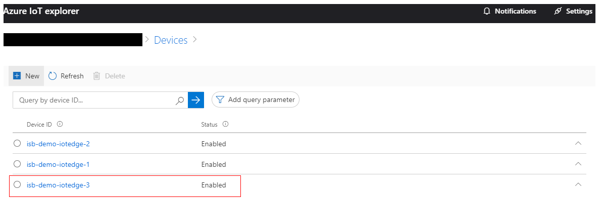

# Deploy the Demo

## Which Resources Get Deployed?

The following resources will be created:

- 3 Ubuntu VMs (2 x IoT Edge, 1 x NATS Cluster) of size _Standard_B1ms_
- 1 x VNET with two Subnets
- 1 x Azure Bastion with public IP
- 1 x IoT Hub of size _S1_

[Approximate Cost Estimate](https://azure.com/e/fb7a1c2c06e44177831868871bedd335)

## Prerequisites

Deployment is done by a __shell script__ which uses the Azure CLI.  
Make sure you either

- [install Azure CLI on your UNIX based OS](https://docs.microsoft.com/en-us/cli/azure/install-azure-cli?view=azure-cli-latest).
- or you use [Azure Cloud Shell](https://docs.microsoft.com/en-us/azure/cloud-shell/overview). __Azure Cloud Shell will timeout after 20 minutes of inactivity__.  
- or you use [this Azure CLI Docker image](https://docs.microsoft.com/en-us/cli/azure/run-azure-cli-docker?view=azure-cli-latest) (also on Windows) for deployment.

If you decide to go with the Docker image on Windows you first need to [activate _FILE SHARING_](https://docs.docker.com/docker-for-windows/#docker-settings-dialog).  
Then just run your container like this:

```none
docker run -v C:\<path-to-the-src-folder-in-this-github-repo>:/isb -it mcr.microsoft.com/azure-cli
```
You will have all files available under `/isb` inside the container.

> Hint: if you cloned this repo in Windows and want to run it in a Linux environment, you will need to chnage the line endings in shell scripts from `CRLF` to `LF`
e.g.  DOS to Linux command `tr -d '\r' < deploy.sh > deployLinux.sh`


## Run Deployment

Clone this repo, navigate to the _deployment_ directory and execute `./deploy.sh [your_subscriptionId] [region]` to start the deployment.

> The subscription ID is optional.
> If you do not provide it, the default subscription will be used.  
> The region is also optional.
> If not specified _West US_ (`westus`) is used (other examples: `eastus`, `westeurope`).

It takes around 25 minutes to deploy and initialize everything.
At the end of a successful deployment the script outputs __SSH username (currently _azureuser_) and the SSH private key__ that you can use to connect to your VMs via SSH.
None of the VMs are exposed via a public IP address which is why you will need to use Azure Bastion (created as part of the deployment) to access them [as described here](https://docs.microsoft.com/bs-cyrl-ba/azure/bastion/bastion-connect-vm-ssh#privatekey).  
After a successful deployment you will have the setup up and running shown here (blue arrows show data flows):


### Important

- Due to the lack of time the deployment script __does not__ implement robust error handling. In case you run into issues: fix those, remove the complete resource group and redeploy
- VM hotnames are important since they are used as conventions in some connection strings like in e.g. `isb-demo-iotedge-1-pn.json` or the `cloud-init-iotedge.yml`. You would need to change those as well.
- After a successful deployment an `.env`-file is written to disk which contains some information used by the `restart-dapr.sh` script. This is just for your convenience so you don't need to look up this information in the Azure Portal.
- `restart-dapr.sh` is used to restart IoT Edge modules containing _Dapr_ runtime. This is needed to account for cases where e.g. _RabbitMQ_ or _Redis_ are started __after__ the _Dapr_ runtime. _Dapr_ runtime currently does not implement a retry mechanism to connect to a message broker in a pub/sub scenario. This is planned for one of the future releases. Also, it is currently not possible to specify a module start order in IoT Edge. [This functionality is planned for the upcoming 1.0.10 RC release](https://github.com/Azure/iotedge/blob/master/doc/ModuleStartupOrder.md).

## Validating Successful Deployment

Download and install [Azure IoT Explorer](https://github.com/Azure/azure-iot-explorer) from [here](https://github.com/Azure/azure-iot-explorer/releases).  
Retrieve the IoT Hub owner connection string as shown here:


Use this connection string to connect using Azure IoT Explorer.  
In Azure IoT Explorer select device _isb-demo-iotedge-3_ as shown here:



Then go to _Telemetry_ -> _Start_. After some time you should see data in OPC UA Pub Sub JSON format:


You should see two different OPC UA NodeIds:

- `\"NodeId\":\"nsu=http://microsoft.com/Opc/OpcPlc/;s=SpikeData\"` from _isb-demo-plc-1_
- `\"NodeId\":\"nsu=http://microsoft.com/Opc/OpcPlc/;s=DipData\"` from _isb-demo-plc-2_

Those PLCs might in reality be located in completely different factories in different locations.  
Still, with ISB it is easy to consume this data without having any knowledge where it exactly comes from.

## Troubleshooting

- You can connect to each VM using Azure Bastion using the provided credentials
  - You can read IoT Edge logs using `iotedge logs <module_name>`
  - You can request logs upload to a storage account using this [direct method on edgeAgent](https://github.com/Azure/iotedge/blob/master/doc/built-in-logs-pull.md)
- In case you don't see the data flowing after a successful deployment try to re-run `restart-dapr.sh`

