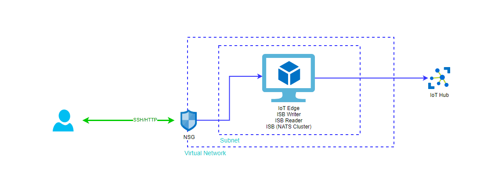

# Deploy the Demo

## Which Resources Get Deployed?

The following resources will be created:

- 1 Ubuntu VMs of size _Standard_B1ms_
  - 1 x IoT Edge
  - 1 x NATS Cluster (Docker-Images)
- 1 x Virtual Network (VNET)
- 1 x Network security group (NSG)
- 1 x Public IP
- 1 x IoT Hub of size _S1_

[Approximate Cost Estimate](https://azure.com/e/baea940d92774a99a6a1e9889788a606)

## Prerequisites

Deployment is done by a __shell script__ which uses the Azure CLI.  
Make sure you either

- [install Azure CLI on your UNIX based OS](https://docs.microsoft.com/en-us/cli/azure/install-azure-cli?view=azure-cli-latest).
- or you use [Azure Cloud Shell](https://docs.microsoft.com/en-us/azure/cloud-shell/overview). __Azure Cloud Shell will timeout after 20 minutes of inactivity__.  
- or you use [this Azure CLI Docker image](https://docs.microsoft.com/en-us/cli/azure/run-azure-cli-docker?view=azure-cli-latest) (also on Windows) for deployment.

If you decide to go with the Docker image on Windows you first need to [activate _FILE SHARING_](https://docs.docker.com/docker-for-windows/#docker-settings-dialog).  
Then just run your container like this:

```none
docker run -v C:\<path-to-the-src-folder-in-this-github-repo>:/isb -it mcr.microsoft.com/azure-cli
```
You will have all files available under `/isb` inside the container.

> Hint: if you cloned this repo in Windows and want to run it in a Linux environment, you will need to change the line endings in shell scripts from `CRLF` to `LF`
e.g.  DOS to Linux command `tr -d '\r' < deploy.sh > deployLinux.sh`


## Run Deployment

Clone this repo, navigate to the _deployment_ directory and execute `./deploy.sh [your_subscriptionId] [region]` to start the deployment.

> The subscription ID is optional.
> If you do not provide it, the default subscription will be used.  
> The region is also optional.
> If not specified _West US_ (`westus`) is used (other examples: `eastus`, `westeurope`).

It takes around 25 minutes to deploy and initialize everything.
At the end of a successful deployment the script outputs __SSH username (currently _azureuser_) and the SSH private key__ that you can use to connect to your virtual machine with the public IP address via SSH.
In case the deployment was successful, you will have the following setup up (blue arrows show data flows):



### Important

- Due to the lack of time the deployment script __does not__ implement robust error handling. In case you run into issues: fix those, remove the complete resource group and redeploy
- VM hostname is important since it is convention in some connection strings like in e.g. `cloud-init-iotedge.yml`. You should change this as well.
- After a successful deployment an `.env`-file is written to disk which contains some information used by the `restart-dapr.sh` script. This is just for your convenience so you don't need to look up this information in the Azure Portal.

## Validating Successful Deployment

Grafana

Review in Azure Portal the assigend public IP of the VM. Use this IP and port 3000 to access the Grafana dashboard. http://"publicIP":3000

Use the default credentials (user: admin, pass: admin) to sign in. In the dashboard manage section you find a configured dashboard named "Voltages".


## Troubleshooting

- You can connect to your VM with public IP and the provided credentials
  - You can read IoT Edge logs using `iotedge logs <module_name>`
  - You can request logs upload to a storage account using this [direct method on edgeAgent](https://github.com/Azure/iotedge/blob/master/doc/built-in-logs-pull.md)
- In case you don't see the data flowing after a successful deployment try to re-run `restart-dapr.sh`

